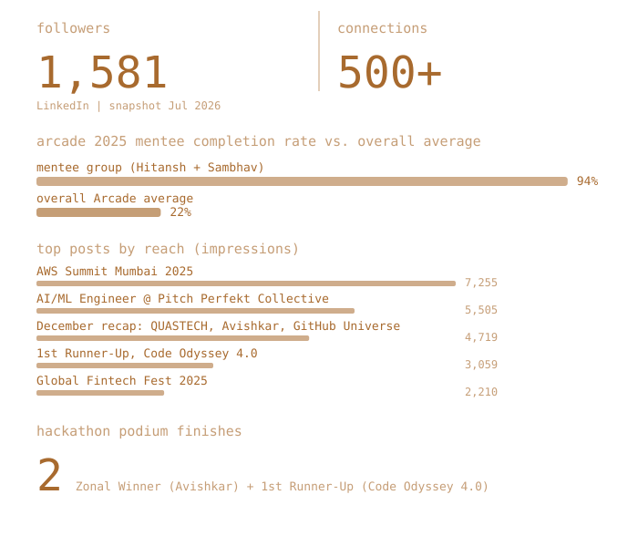
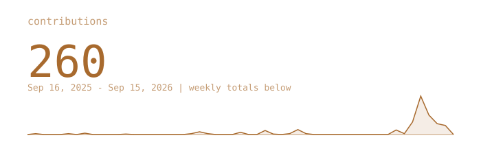
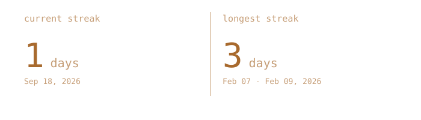
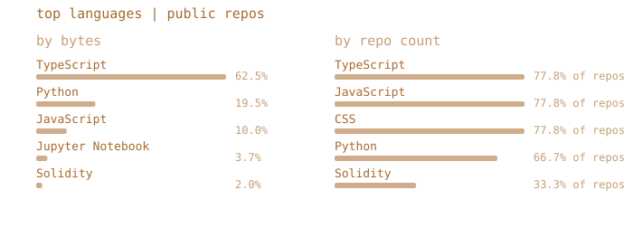
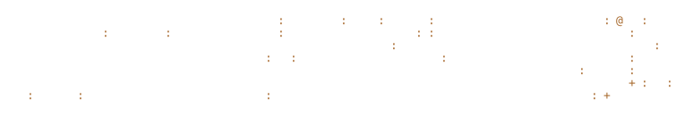

  

 

> Hitansh Gopani &middot; he/him &middot; Mumbai, India 
> AI/ML Engineer @ Pitch Perfekt Collective &middot; K J Somaiya Institute of Technology (IT Engineering)

[linktr.ee/Crypto_HG](https://linktr.ee/Crypto_HG) &nbsp;&middot;&nbsp; [linkedin.com/in/hitanshgopani](https://www.linkedin.com/in/hitanshgopani/) &nbsp;&middot;&nbsp; [github.com/Hitanshuser50](https://github.com/Hitanshuser50)

 

 

Building AI systems people can rely on every day, not just clever demos
&mdash; currently at Pitch Perfekt Collective, working on the systems that
keep creative AI workflows organized, reusable, and production-ready.

Also an AI/ML Trainer at QUASTECH and a Google Arcade Facilitator, teaching
cloud and GenAI to students who are usually earlier in the journey than I am.

<samp>Snowflake Zero-to-Agents &nbsp;&middot;&nbsp; Lean Six Sigma (Foundations + Services) &nbsp;&middot;&nbsp; Zonal Winner, Avishkar &nbsp;&middot;&nbsp; 1st Runner-Up, Code Odyssey 4.0</samp>

 

 

- **AI/ML Engineer, Pitch Perfekt Collective** &mdash; building the systems that keep creative AI workflows organized, reusable, and production-ready. [post](https://www.linkedin.com/feed/update/urn:li:activity:7479760764765900800/)
- **Snowflake "Zero to Agents"** &mdash; Cortex Analyst (text-to-SQL), Cortex Search (RAG), semantic layer, dynamic tables, and column-level governance, end to end in one session. [post](https://www.linkedin.com/feed/update/urn:li:activity:7443004472576065536/)
- **AI/ML Trainer, QUASTECH** &middot; **Zonal Winner, Avishkar** &middot; GitHub Universe Mumbai recap &mdash; all from one December. [post](https://www.linkedin.com/feed/update/urn:li:activity:7408198018757496832/)
- **Global Fintech Fest 2025** &mdash; tokenization, agentic payments, and India's real-time payments scale, from the floor. [post](https://www.linkedin.com/feed/update/urn:li:activity:7383551171556306944/)
- **1st Runner-Up, Code Odyssey 4.0** (Tata STRIVE &times; K J Somaiya Institute of Technology) &mdash; OCR + multilingual NLP + LLMs to turn handwritten business ideas into structured pitches. [post](https://www.linkedin.com/feed/update/urn:li:activity:7378766742342266880/)
- **Snowflake World Tour, Mumbai** &mdash; data foundations, governed AI at scale. [post](https://www.linkedin.com/feed/update/urn:li:activity:7374496607817351169/)
- **Google Arcade 2025 Facilitator** &mdash; ran a mentorship group that hit a 94% completion rate against a 22% overall average. [post](https://www.linkedin.com/feed/update/urn:li:activity:7354037096753303555/)
- **AWS Summit Mumbai 2025** &middot; Lean Six Sigma Foundations + Apply Lean Six Sigma to Services certifications. [post](https://www.linkedin.com/feed/update/urn:li:activity:7341890971137150977/)

 

 

Hand-updated from LinkedIn (no public API to automate this one) &mdash; not part of the nightly refresh below.

  

 

 
<samp>&nbsp;&nbsp;quiet&nbsp;&middot;&nbsp;&nbsp;:&nbsp;&nbsp;+&nbsp;&nbsp;#&nbsp;&nbsp;@&nbsp;&nbsp;&middot;&nbsp;loud</samp>

  

 

<samp>python &nbsp;jupyter &nbsp;git</samp>

  

Every graphic above is generated inside this repository, not pulled from a third-party
stats-card service &mdash; the portrait is a real photo pushed through a character ramp by
<code>scripts/make_portrait.py</code>; the stats are drawn straight from the GitHub GraphQL API by a
scheduled Action once a day, committing only what changed. They animate once, on load, using
SMIL inside the SVG (GitHub strips <code>&lt;script&gt;</code> from README images, but SMIL survives) &mdash;
nothing here makes a request to anyone else's server, so nothing here can rate-limit or go dark.
  
Portrait pipeline adapted from the <a href="https://burly-handstand-0dc.notion.site/ASCII-Portrait-README-Guide-3a3e3f86338481f0b545ec8120bbf604">ASCII Portrait README Guide</a>.
Typeface: <a href="assets/fonts/OFL.txt">JetBrains Mono</a>, SIL OFL 1.1.

