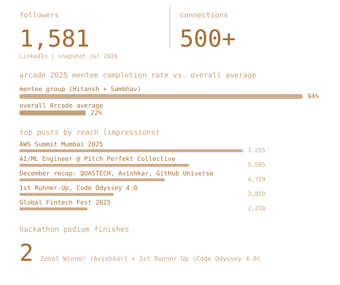
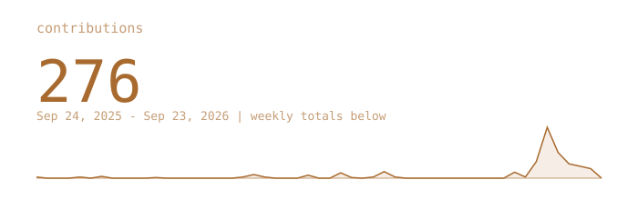
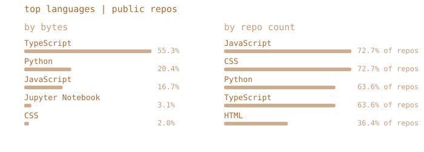
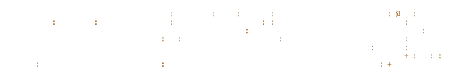

  

 

> Hitansh Gopani &middot; he/him &middot; Mumbai, India 
> AI/ML Engineer @ Pitch Perfekt Collective &middot; K J Somaiya Institute of Technology (IT Engineering)

[linktr.ee/Crypto_HG](https://linktr.ee/Crypto_HG) &nbsp;&middot;&nbsp; [linkedin.com/in/hitanshgopani](https://www.linkedin.com/in/hitanshgopani/) &nbsp;&middot;&nbsp; [github.com/Hitanshuser50](https://github.com/Hitanshuser50)

 

 

I build AI systems people can rely on every day, not just clever demos. Most of
my work sits where a model's output has to be checked before anyone acts on it:
voice intake that turns answers into validated structured data, ML pipelines
with honest evaluation, and on-chain systems where the claim is verifiable
instead of taken on trust.

Currently an AI/ML Engineer at Pitch Perfekt Collective, working on the systems
that keep creative AI workflows organized, reusable, and production-ready.

 

## Featured work

### [VoxGate](https://github.com/Professional50coder/voxgate) &nbsp;&middot;&nbsp; [Live](https://voxgate-web.vercel.app)

**Voice interviews for regulated intake, where every answer has to be defensible.**

- Questions are read verbatim, and spoken answers become checked, structured data rather than free-form transcripts.
- Produces an explainable risk score, then routes the case to a human reviewer with a full audit trail.
- Ships nine use-case packs, each with its own per-agent voice.

### [NightFleet](https://github.com/Professional50coder/nightfleet) &nbsp;&middot;&nbsp; [Live](https://nightfleet.vercel.app)

**Battleship on Midnight where hidden fleets are enforced by zero-knowledge proofs, not by a trusted server.**

- Each fleet is committed on-chain as `hash(board, salt)`; every hit/miss answer is a proof checked against that commitment, so moving ships mid-game fails verification.
- Compact contract with six circuits, deployed to Midnight Preprod; squad mode runs a two-player game entirely on-chain through the Lace wallet.
- 267 automated tests, including a 54-case adversarial suite that plays the cheater; deterministic three-tier AI opponent that plays through the real game API.

### [Crucible](https://github.com/Professional50coder/crucible) &nbsp;&middot;&nbsp; [Live](https://crucible-orpin.vercel.app)

**Verifiable fine-tuning on 0G: every fine-tuned model gets a passport anyone can check without a wallet.**

- Collects a model's lineage (base-model hash, dataset storage root, hyperparameters, TEE-attested delivery) into a manifest on 0G Storage, with its `keccak256` anchored by a verified `Passport.sol` contract.
- Diagnosed an SDK retrieval defect that lost a paid fine-tune on Windows, then replaced the download path with an HTTP retriever that re-derives the storage root before acknowledging.
- 104 contract tests; three passports minted on 0G Galileo testnet, the latest from a real adapter with a verified attestation.

### [Sigma](https://github.com/Professional50coder/somnia-sigma) &nbsp;&middot;&nbsp; [Live](https://frontend-jade-beta-md6533cyvr.vercel.app)

**A fair-value layer for dreamDEX event contracts on Somnia: what the odds should be, next to what the market quotes.**

- Computes fair probability with `Φ(d₂)` in Solidity from on-chain EWMA realized volatility, publishing Gaussian and Student-t estimates side by side with edge, break-even, and Kelly sizing.
- Five contracts deployed and verified on Somnia Shannon testnet, with 117 Hardhat tests and math cross-checked against SciPy.
- Includes an Edge Radar frontend, a backtesting harness, and a trading bot (dry-run validated).

### [ClaimifyEasy](https://github.com/Professional50coder/ClaimifyEasy) &nbsp;&middot;&nbsp; [Live](https://claimifyeasy-bice.vercel.app)

**One workspace for medical insurance claims across patients, hospitals, insurers, and admins.**

- Role-based dashboards covering the full claim lifecycle from submission to settlement, with document handling and analytics.
- Gemini-backed assistant via the Vercel AI SDK, plus a coverage calculator for out-of-pocket estimates.
- Smart-contract settlement examples in Solidity and Rust; built on Next.js App Router, TypeScript, Tailwind, and shadcn/ui.

### [ChainIntel Pro](https://github.com/Professional50coder/blockchain-gnn-link-prediction) &nbsp;&middot;&nbsp; [Live](https://blockchain-gnn-link-prediction.streamlit.app)

**Link prediction and unsupervised fraud detection over the Ethereum transaction graph.**

- GraphSAGE learns a 64-dimensional embedding per wallet; pair scores predict future transactions and an Isolation Forest flags anomalous wallets without labels.
- Training and serving are split at an artifact boundary, so the Streamlit dashboard never imports PyTorch and runs on a free CPU tier.
- Live mainnet lookup through Etherscan and Web3.py scores real addresses against the trained model.

 

## Other public projects

| Project | What it is |
|---|---|
| [incident-intel](https://github.com/Professional50coder/incident-intel) | Video anomaly detection as a running system: versioned data pipeline, three-way model comparison on UCSD Ped2, PyTorch autoencoder, FastAPI backend, and a Next.js + Three.js dashboard. |
| [trustllm](https://github.com/Professional50coder/trustllm) | LLM evaluation and governance platform: run a prompt across models, compare metrics, and gate deployment with configurable guardrails and audit logs. |
| [SapnaForge](https://github.com/Professional50coder/SapnaForge) | Multilingual pipeline that turns handwritten and spoken business ideas into structured pitches with feedback; built for Code Odyssey 4.0 with Tata STRIVE. |

 

 

<samp>ML: PyTorch, GraphSAGE, scikit-learn, OpenCV &nbsp;&middot;&nbsp; LLMs: Gemini, LangChain, Vercel AI SDK &nbsp;&middot;&nbsp; Chains: Midnight (Compact), 0G, Somnia, Ethereum &nbsp;&middot;&nbsp; Data: Snowflake Cortex, SQLite, MongoDB</samp>

  

 

Also an AI/ML Trainer at QUASTECH and a Google Arcade Facilitator, teaching
cloud and GenAI to students who are usually earlier in the journey than I am.

- **AI/ML Engineer, Pitch Perfekt Collective** &mdash; building the systems that keep creative AI workflows organized, reusable, and production-ready. [post](https://www.linkedin.com/feed/update/urn:li:activity:7479760764765900800/)
- **Snowflake "Zero to Agents"** &mdash; Cortex Analyst (text-to-SQL), Cortex Search (RAG), semantic layer, dynamic tables, and column-level governance, end to end in one session. [post](https://www.linkedin.com/feed/update/urn:li:activity:7443004472576065536/)
- **AI/ML Trainer, QUASTECH** &middot; **Zonal Winner, Avishkar** &middot; GitHub Universe Mumbai recap &mdash; all from one December. [post](https://www.linkedin.com/feed/update/urn:li:activity:7408198018757496832/)
- **Global Fintech Fest 2025** &mdash; tokenization, agentic payments, and India's real-time payments scale, from the floor. [post](https://www.linkedin.com/feed/update/urn:li:activity:7383551171556306944/)
- **1st Runner-Up, Code Odyssey 4.0** (Tata STRIVE &times; K J Somaiya Institute of Technology) &mdash; OCR + multilingual NLP + LLMs to turn handwritten business ideas into structured pitches. [post](https://www.linkedin.com/feed/update/urn:li:activity:7378766742342266880/)
- **Snowflake World Tour, Mumbai** &mdash; data foundations, governed AI at scale. [post](https://www.linkedin.com/feed/update/urn:li:activity:7374496607817351169/)
- **Google Arcade 2025 Facilitator** &mdash; ran a mentorship group that hit a 94% completion rate against a 22% overall average. [post](https://www.linkedin.com/feed/update/urn:li:activity:7354037096753303555/)
- **AWS Summit Mumbai 2025** &middot; Lean Six Sigma Foundations + Apply Lean Six Sigma to Services certifications. [post](https://www.linkedin.com/feed/update/urn:li:activity:7341890971137150977/)

<samp>Snowflake Zero-to-Agents &nbsp;&middot;&nbsp; Lean Six Sigma (Foundations + Services) &nbsp;&middot;&nbsp; Zonal Winner, Avishkar &nbsp;&middot;&nbsp; 1st Runner-Up, Code Odyssey 4.0</samp>

 

 

  

 

  

## Contact

[linktr.ee/Crypto_HG](https://linktr.ee/Crypto_HG) &nbsp;&middot;&nbsp; [linkedin.com/in/hitanshgopani](https://www.linkedin.com/in/hitanshgopani/) &nbsp;&middot;&nbsp; [github.com/Hitanshuser50](https://github.com/Hitanshuser50)
